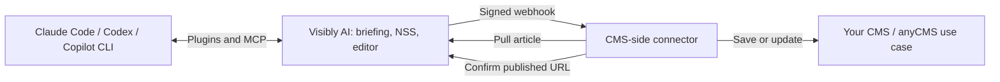

# Visibly AI CMS Connector

Connect your Python/Flask CMS to **[Visibly AI](https://app.visibly-ai.com)**:
receive signed article events, fetch the approved content, save it in your CMS
and report its published URL back to Visibly.

Previously named `ai-content-autopilot` on GitHub. The Python distribution
**`ai-content-autopilot`** and import **`ai_content_autopilot`** keep their names
so existing installations continue to work.

**[Zusammenhang auf Deutsch](https://github.com/AntonioBlago/visibly-ai-cms-connector/blob/master/docs/INTEGRATION_DE.md)** ·
[AI assistant plugins](https://github.com/AntonioBlago/visiblyai-mcp-server/blob/master/PLUGINS.md) ·
[CMS use cases](https://github.com/AntonioBlago/anycms)

## How the projects fit together

| Component | Role |
| --- | --- |
| [Visibly MCP and plugins](https://github.com/AntonioBlago/visiblyai-mcp-server) | Connect Claude Code, Codex and Copilot CLI to project context, skills, article drafts and NSS scoring in Visibly. |
| [Visibly AI](https://app.visibly-ai.com) | Holds projects, briefings, drafts, scores, approvals and CMS connections. Content can come from an external agent or the Content Autopilot. |
| **Visibly AI CMS Connector** (this repository) | Python SDK for the CMS side: Pull API client, signed webhook receiver and publication confirmation. Your handler controls CMS storage and publication. |
| [anyCMS](https://github.com/AntonioBlago/anycms) | Concrete use cases for WordPress, Astro, Next.js and Flask. Flask uses this SDK; the PHP/TypeScript implementations follow the same API contract. |



The agent writes with its own model and can improve a draft toward NSS 70 or 80.
See [what the NSS measures, how to interpret it and its limits](https://www.visibly-ai.com/nss-score).
Its methodological foundation is Antonio Blago's
[Neuro-SEO-System®](https://www.antonioblago.com/de/neuro-seo-system/) (German overview).
Existing context, deterministic NSS scoring and draft saving use 0 Visibly
credits; the assistant's tokens and new paid analyses are billed separately.
Saving a draft does not publish it. Publishing or updating a website is a
separate operation with the required project permissions and CMS connection.

The CMS connector does not generate text or calculate NSS. It transfers the
article into your application. `202 Accepted` means a webhook was received;
publication is confirmed only after the CMS has made the article available.
There is no universal 30-minute sync interval: timing depends on your webhook
handler, background processing or a polling schedule that you configure.

## What this SDK provides

- **Pull API Client** — fetch, list, and confirm articles programmatically
- **Webhook Receiver** — a ready-made Flask Blueprint that verifies HMAC signatures, fetches full article content, and calls your handler
- **HMAC-SHA256 Verification** — standalone signature verification for custom webhook implementations

## How It Works

```
1. An article is prepared in Visibly and approved for publication
   (or an existing published article is explicitly sent for update)
                    |
2. Webhook fires to your endpoint (POST /webhooks/visibly)
   with HMAC-SHA256 signature for security
                    |
3. Your app verifies the signature and acknowledges receipt (202 by default),
   then calls the Pull API in the background
   to fetch the full article (HTML, Markdown, keywords, SEO score)
                    |
4. Your app saves/publishes the article in your CMS
                    |
5. Your app confirms publication back to Visibly
   (article status changes to "published")
```

## Installation

```bash
pip install ai-content-autopilot
```

**Requirements:** Python 3.8+, Flask 2.3+, Requests 2.25+

## Getting Started

### 1. Get your credentials

Requirement: a Visibly account on the **Standard plan or higher**. This package
pulls articles managed in Visibly, and the Autopilot (CMS connection,
project API key) is not part of the Free plan. Pick a plan under
[Settings](https://app.visibly-ai.com/settings) first.

Everything else happens on one page: **Content Tools > Content Autopilot**
(`https://app.visibly-ai.com/tools/content/autopilot/<project-id>`), card
**CMS-Zugänge**.

- **API Key**: under **Contentpilot-API-Key (Pull)** click **Key erzeugen**. The
  key starts with `cp_`, is shown once, and only sees this project. An
  account-wide `lc_` key from [Settings > API-Key & MCP](https://app.visibly-ai.com/settings#api-key)
  works too (Standard plan or higher), but it sees every project.
- **Webhook Secret**: under **Neuen Zugang hinterlegen** create a connection of
  type **Webhook (Pull-CMS)** with your endpoint URL and a secret of your choice,
  and tick the events `article.approved` and `article.updated`. Paste the same
  secret into your app.

Full protocol: [anyCMS CONTRACT.md](https://github.com/AntonioBlago/anycms/blob/main/docs/CONTRACT.md)

### 2. Choose your integration style

#### Option A: Full Flask Blueprint (recommended)

The easiest way to integrate. Register the blueprint and provide a handler function — the SDK handles signature verification, article fetching, and error responses automatically.

```python
from flask import Flask
from ai_content_autopilot import configure_visibly, contentpilot_webhook_bp

app = Flask(__name__)

def my_handler(article):
    """Called when a webhook delivers an article.

    article dict contains:
      id, title, slug, content_html, content_markdown,
      keywords, meta_description, seo_score, word_count,
      _webhook_event, _webhook_timestamp, _scheduled_date
    """
    # Save to your database, CMS, filesystem, etc.
    db.session.add(Post(
        title=article['title'],
        body=article['content_html'],
        slug=article['slug'],
        publish_at=article.get('_scheduled_date'),
    ))
    db.session.commit()
    return True  # Processing succeeded; publication confirmation is a separate call.

configure_visibly(
    webhook_secret='your-webhook-secret',
    api_key='cp_your_project_key',
    on_article_received=my_handler,
)

app.register_blueprint(contentpilot_webhook_bp)
# POST /webhooks/visibly is now active and handles:
#   1. HMAC-SHA256 signature verification
#   2. HTTP 202 acknowledgement (background=True, the default)
#   3. Full article fetch and my_handler(article) in a background thread
# Handler failures are logged; 202 does not mean the article is published.
```

#### Option B: Standalone Pull API Client

Use the client directly to poll for articles or integrate into non-Flask applications.

```python
from ai_content_autopilot import VisiblyClient

client = VisiblyClient(api_key='cp_your_project_key')

# List approved articles ready for publishing
articles = client.list_articles(status='approved', project_id=5, limit=20)
for a in articles:
    print(a['id'], a['title'], a.get('scheduled_date'))

# Fetch a single article with full content
article = client.fetch_article(42, include_markdown=True)
print(article['content_html'])
print(article['keywords'])       # e.g. ["seo", "keyword research"]
print(article['seo_score'])      # 0-100

# Confirm publication (updates status to "published" in Visibly)
client.confirm_published(42, 'https://myblog.com/seo-guide-2026')
```

#### Option C: HMAC verification only

For custom webhook implementations in any framework.

```python
from ai_content_autopilot import verify_webhook_signature

# In your webhook endpoint:
payload_bytes = request.get_data()       # raw bytes, NOT request.json
signature = request.headers.get('X-Webhook-Signature', '')

if not verify_webhook_signature(payload_bytes, 'your-secret', signature):
    return {'error': 'Invalid signature'}, 401
```

## Article Lifecycle

| Status | Description | Webhook Event |
|--------|-------------|---------------|
| `queued` | Waiting to be generated | - |
| `generating` | AI is writing the article | - |
| `draft` | Draft ready for review | - |
| `approved` | Ready for publishing | `article.approved` |
| `published` | Confirmed published via API | `article.published` |
| `rejected` | Rejected by user | - |
| `failed` | Generation failed | `article.failed` |

An already published article that is edited in Visibly and pushed back fires
`article.updated`. The payload carries `published_url` and `revision` so you
can find the existing post by URL and skip a state you already have.

## API Reference

| Function / Class | Description |
|---|---|
| `configure_visibly(webhook_secret, api_key, base_url, on_article_received, background)` | Configure the Blueprint. `background=True` (default) acknowledges with 202 and works in a thread |
| `verify_webhook_signature(payload_bytes, secret, signature_header)` | Verify HMAC-SHA256 signature. Returns `True`/`False` |
| `VisiblyClient(api_key, base_url, timeout)` | Pull API client for fetching, listing, and confirming articles |
| `client.fetch_article(article_id, include_markdown)` | Returns article dict or `None` on error |
| `client.list_articles(status, project_id, limit, offset)` | Returns list of article dicts |
| `client.confirm_published(article_id, published_url)` | Confirms publication. Returns `True`/`False` |
| `contentpilot_webhook_bp` | Flask Blueprint. Register with `app.register_blueprint()`. Endpoint: `POST /webhooks/visibly` |
| `default_flask_blog_handler(article)` | Default handler: saves article as JSON to `./content_output/` |

## Webhook Payload

When a webhook fires, the `POST /webhooks/visibly` endpoint receives a JSON body with these fields:

```json
{
  "event": "article.approved",
  "article_id": 42,
  "title": "SEO Guide 2026",
  "slug": "seo-guide-2026",
  "project_id": 5,
  "scheduled_date": "2026-03-01T09:00:00",
  "pull_url": "https://app.visibly-ai.com/api/v1/articles/42",
  "timestamp": "2026-02-20T10:00:00Z"
}
```

| Field | Type | Description |
|-------|------|-------------|
| `event` | string | `article.approved`, `article.updated`, `article.published`, or `article.failed` |
| `article_id` | int | Database ID of the article |
| `title` | string | Article title |
| `slug` | string | URL-safe slug |
| `project_id` | int | Owning project ID |
| `scheduled_date` | string/null | ISO 8601 scheduled publish date, or `null` |
| `pull_url` | string | Full URL to fetch article content via Pull API |
| `timestamp` | string | ISO 8601 UTC timestamp of the event |
| `published_url` | string | Live URL of the existing post (`article.updated` only) |
| `revision` | int | Counter that increases on every write in Visibly (`article.updated` only) |

The Blueprint fetches the full article via the Pull API and injects webhook metadata (`_webhook_event`, `_webhook_timestamp`, `_scheduled_date`, `_published_url`, `_revision`) into the article dict before calling your handler.

## Article Response Fields

When fetching an article via `VisiblyClient.fetch_article()`, the returned dict contains:

| Field | Type | Description |
|-------|------|-------------|
| `id` | int | Unique article ID |
| `title` | string | Article title |
| `slug` | string | URL-friendly slug |
| `status` | string | Current status (see Article Lifecycle) |
| `content_html` | string | Full article as HTML |
| `content_markdown` | string | Article as Markdown (only if `include_markdown=True`) |
| `keywords` | list | Target keywords, e.g. `["seo", "keyword research"]` |
| `meta_description` | string | SEO meta description (max 160 chars) |
| `seo_score` | int | SEO optimization score (0-100) |
| `word_count` | int | Article word count |
| `project_id` | int | Owning project ID |
| `plan_id` | int/null | Content cluster the article belongs to |
| `url_prefix` | string/null | Path prefix of the cluster, e.g. `/glossary/` |
| `content_language` | string/null | Language of the cluster, e.g. `de`, `en` |
| `target_country` | string/null | Target country of the cluster, e.g. `DE` |
| `recommended_page_type` | string | Page template hint, e.g. `guide`, `blog` |
| `revision` | int | Increases on every write in Visibly |
| `content_format` | string | `html` or `markdown` |
| `published_url` | string | Public URL after publication (empty if unpublished) |
| `scheduled_date` | string/null | Planned publish date (ISO 8601) |
| `created_at` | string | Creation timestamp |
| `updated_at` | string | Last update timestamp |

## Delivery Contract

**A webhook is a signal, not a job with a return value.** Visibly waits 10
seconds for your response, and this is what each outcome means to it:

| Your response | How Visibly reads it |
|---|---|
| `202` | Receipt accepted; processing/publication still needs confirmation. |
| `200` with a body naming `blog_post_id`, `post_id` or `id` | Processed, done. |
| `200` with a JSON body naming none of those | Acknowledged, but nothing happened. Logged as a failure with your message. |
| `4xx` | Rejected. Not retried, a second attempt would fail the same way. |
| `5xx`, `429` | Transient. Retried after 1s, 5s, 25s. |
| No response within 10s (read timeout) | Delivered, outcome unknown. **Not retried.** |

That last row is the one that matters. Up to v1.0.2 this SDK fetched the
article and ran your handler inside the request. If your handler was slow, and
translating an article into several languages is slow, Visibly gave up waiting
and delivered again. Measured in production on 2026-09-14: three delivery
attempts for one article turned into three LLM translation runs on the
receiving CMS.

Both sides are fixed now. Visibly no longer retries on a read timeout, because
the request had already reached you. And this SDK acknowledges with `202`
before doing any work:

```python
configure_visibly(
    webhook_secret='...',
    api_key='...',
    on_article_received=my_handler,
    background=True,   # the default: acknowledge first, work afterwards
)
```

The background path also keeps a process-local register of articles currently
being processed, so a repeated delivery is skipped instead of running your
handler twice. With multiple web workers that register does not span
processes. If double processing would be expensive for you, add a claim column
in your own database.

Set `background=False` only if your handler reliably finishes inside those 10
seconds. You then get the synchronous response codes (200 / 422 / 500 / 502).

## Multilingual Sites and hreflang

**Visibly writes one article in one language.** There is no translation
endpoint, and no article carries several language variants. Going multilingual
is a structural decision, not a post-processing step, and you have two ways to
make it.

### Option A: your CMS translates

You receive the source article and produce the other languages yourself. This
is what [TMPilot.ai](https://www.tmpilot.ai) does: one German article arrives,
the CMS translates it and stores all languages under one post.

- **You own** the translation cost, the glossary, and the consistency between
  languages.
- **Visibly sees one article.** A later `article.updated` overwrites your
  source language, and your CMS re-derives the rest.
- Slow by nature, which is exactly why your handler must not run inside the
  webhook request. See **Delivery Contract** above.

### Option B: one cluster per language

A content cluster in Visibly is a plan with its own path prefix, language and
target country. Create one per language, and Visibly writes each article
natively in that language instead of translating it:

| Cluster | `content_language` | `target_country` | `url_prefix` |
|---|---|---|---|
| Glossary DE | `de` | `DE` | `/glossar/` |
| Glossary EN | `en` | `US` | `/en/glossary/` |
| Glossary FR | `fr` | `FR` | `/fr/glossaire/` |

Every article then arrives with those three fields, and **you build the URL**:

```python
def my_handler(article):
    prefix = article.get('url_prefix') or '/'
    url = f"https://example.com{prefix}{article['slug']}"
    lang = article.get('content_language')  # 'de', 'en', 'fr' - or None
    ...
```

- **Native phrasing per language**, not a translation of German sentence
  structure. Keywords are researched per market.
- **Costs one article per language** against your monthly quota.

### How the hreflang structure comes about

**Visibly does not build URLs and does not emit hreflang tags.** It delivers
`slug`, `url_prefix` and `content_language` as the blueprint; the finished URL
is yours, and you report it back with `confirm_published()`. The tags are
therefore yours to render:

```html
<link rel="alternate" hreflang="de" href="https://example.com/glossar/nizza-klasse/">
<link rel="alternate" hreflang="en" href="https://example.com/en/glossary/nice-class/">
<link rel="alternate" hreflang="fr" href="https://example.com/fr/glossaire/classe-de-nice/">
<link rel="alternate" hreflang="x-default" href="https://example.com/en/glossary/nice-class/">
```

Three rules that generators get wrong more often than not:

1. **Every variant links to every variant, including itself.** A page that
   omits its own hreflang is treated as an incomplete set and ignored.
2. **`x-default` points at the version for visitors none of the others fit**,
   usually the English one. It is not "the site's default language".
3. **Only link pages that exist and are indexable.** An hreflang pointing at a
   `noindex` page or a 404 invalidates the whole cluster.

**What Visibly does not tell you yet:** which articles are translations of one
another. Two clusters deliver two independent articles, and there is no group
identifier linking them. Keep that mapping on your side, using the cluster
pair plus your own topic key, or derive it from `plan_id` and the order in
which topics were queued.

## Webhook Security

Every webhook request includes an `X-Webhook-Signature` header with an HMAC-SHA256 signature:

```
X-Webhook-Signature: sha256=<hex_digest>
```

The SDK verifies this automatically when using the Blueprint. The verification uses `hmac.compare_digest` for timing-safe comparison to prevent timing attacks.

## Error Handling

The `VisiblyClient` methods handle errors gracefully:

- `fetch_article()` returns `None` on any error (404, network failure, timeout)
- `list_articles()` returns `[]` on any error
- `confirm_published()` returns `False` on any error

All errors are logged via Python's `logging` module at WARNING or ERROR level.

When using the Blueprint with `background=True` (the default), HTTP responses are:

| Code | Meaning |
|------|---------|
| 202 | Accepted — fetching and processing in the background |
| 202 `already_processing` | This article is already being processed, duplicate skipped |
| 400 | Invalid JSON in webhook payload |
| 401 | HMAC signature verification failed |
| 500 | Webhook secret or API key not configured |

A failure inside your handler does **not** become a 5xx: the delivery
succeeded, the work did not. A 5xx would invite a retry that reproduces the
same error. Failures are logged, so watch your logs rather than the HTTP
status.

With `background=False` the response reflects the outcome of the work:

| Code | Meaning |
|------|---------|
| 200 | Success — article processed |
| 422 | Handler returned `False` (article rejected) |
| 500 | Webhook not configured, or handler raised an exception |
| 502 | Failed to fetch article from Pull API |

## Rate Limits

The Visibly API enforces the following rate limits:

| Endpoint | Limit |
|----------|-------|
| `GET /api/v1/articles` | 120 requests/min |
| `GET /api/v1/articles/{id}` | 60 requests/min |
| `POST /api/v1/articles/{id}/confirm` | 30 requests/min |

When rate-limited, the API returns HTTP 429 with a `Retry-After` header.

## Links

- [Visibly AI](https://app.visibly-ai.com) — the platform
- [API Keys](https://app.visibly-ai.com/settings) — manage your API keys
- [GitHub Repository](https://github.com/AntonioBlago/visibly-ai-cms-connector)
- [PyPI Package](https://pypi.org/project/ai-content-autopilot/)

## Development

```bash
git clone https://github.com/AntonioBlago/visibly-ai-cms-connector.git
cd visibly-ai-cms-connector
pip install -e ".[dev]"
pytest tests/ -v
```

## License

MIT - see [LICENSE](LICENSE) for details.
